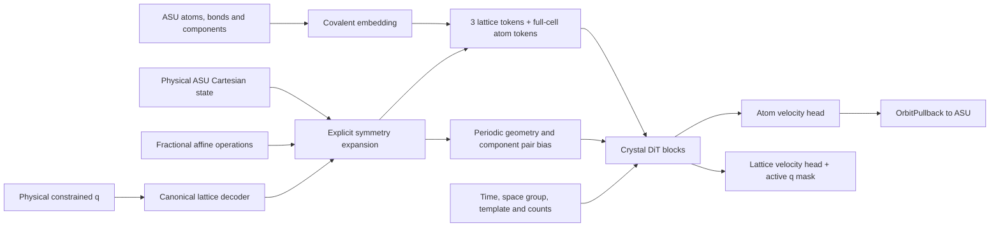

# Architecture and tensor contract

SALA separates a compact asymmetric-unit (ASU) state from the full periodic environment used by the network. This package exposes the velocity-field network and its geometric operators. It does not include a trained generator or the surrounding flow-matching pipeline.



## Retained structure

- Two covalent message-passing layers encode the ASU chemical graph. Features include element, hybridization, formal charge, and component context.
- Explicit fractional operations generate the complete cell. Each graph uses `3 + N_ASU × |G|` valid tokens, with padding masked in a batch.
- A single pair embedding combines periodic distances/displacements, covalent bonds and component relations. Its per-head additive bias is shared across blocks; each block can remix/rescale it. This is not an iterative pair-update trunk.
- Fused QKV attention, QK normalization, time-conditioned adaptive normalization, SwiGLU branches, and magnitude-preserving mixers/residuals operate on the tokens.
- The atom head predicts complete-cell Cartesian vectors, which OrbitPullback maps to the ASU tangent. The lattice head returns six slots with inactive entries exactly masked out.
- Optional self-conditioning accepts caller-supplied clean-endpoint residuals. The model does not compute a preliminary sample or endpoint on its own.

The symmetry guarantees belong to the supplied operation set, lattice templates and orbit operators. The entire neural network is not claimed to be generally SE(3)-equivariant. Callers must supply a consistent crystallographic setting, chemical graph and operation set; affine-shape validation is not a symmetry-detection algorithm.

## Batch layout

Let `B` be the number of crystals, `N` the total number of ASU heavy atoms, `C` the total number of ASU component instances, `E` the number of directed covalent edges, and `Gmax` the maximum number of symmetry operations. Atom and component indices are global within the packed batch.

| `AsuBatch` field | Shape | Meaning |
|---|---|---|
| `atom_types` | `[N]` | Integer atomic numbers; the reference embedding has 119 entries |
| `spacegroup` | `[B]` | International space-group numbers, 1–230 |
| `component_id` | `[N]` | Contiguous global component indices, 0 through C−1 |
| `atom_formal_charge`, `atom_charge_mask` | `[N]` | Integer formal charges and authoritative boolean availability mask |
| `component_formal_charge` | `[C]` | Formal charge per component |
| `component_type_id` | `[C]` | Chemical component-type identifier; equality describes shared type |
| `component_batch` | `[C]` | Graph index for each component |
| `num_atoms`, `ptr`, `batch` | `[B]`, `[B+1]`, `[N]` | Counts, cumulative atom offsets starting at 0, and graph index per atom |
| `edge_index_conv`, `edge_attr_conv` | `[2,E]`, `[E]` | Directed intra-ASU covalent edges and zero-based bond categories; include both directions |
| `frac_coords_gt`, `lattice_gt` | `[N,3]`, `[B,3,3]` | Original container fields; see the important distinction below |
| `lattice_template_id` | `[B]` | Explicit setting-compatible `LatticeTemplate` values |
| `symmetry_ops`, `symmetry_mask` | `[B,Gmax,4,4]`, `[B,Gmax]` | Padded fractional affine matrices and active-operation mask |
| `hybridization` | `[N]`, optional | Integer hybridization categories; omitted values use category 0 |
| `n_symops`, `n_full_atoms` | `[B]`, optional | Consistency declarations checked when an orbit plan is built |

Although the original container names contain `_gt`, an architecture forward pass does **not** require an experimental target. `frac_coords_gt` supplies a reference geometry for general-position validation when the orbit plan is prepared. Use valid initial/reference fractional coordinates such as the explicitly synthetic inputs in the example. `lattice_gt` is retained for container compatibility; the forward geometry comes from the `physical_q` decoder (or `geometry_q` if supplied). The network's current atom geometry comes from `physical_x`.

Operations act on fractional column coordinates as `R @ f + t`; each 4×4 matrix stores `R` in `[:3,:3]`, `t` in `[:3,3]`, and `[0,0,0,1]` in the last row. Lattice basis vectors are **rows**, so a fractional row vector maps to Cartesian coordinates by `cart = frac @ lattice`. Translations differing by an integer lattice vector are canonicalized to the same operation.

Keep each molecular component geometrically contiguous, including unwrapped coordinates for molecules crossing a cell boundary. The pair embedding uses raw differences within one component instance. This package does not unwrap or canonicalize molecular coordinates, so applying modulo one independently to every atom can break the intramolecular geometry.

Special positions and intersecting orbits are rejected by the default general-position checks. Explicit Wyckoff stabilizers and atom-permutation actions are not implemented. Do not turn off validation merely to accept unsupported structures.

## Forward call and units

```python
atom_velocity, q_velocity = model(
    batch,
    model_x,        # [N,3]
    physical_q,     # [B,6]
    time,           # [B]
    physical_x=physical_x,
    model_q=model_q,
    atom_input_scale=atom_input_scale,  # [B]
)
```

- `physical_x` is the current ASU Cartesian state in the length units used by the lattice (Å in the reference pipeline). If omitted, the model falls back to `model_x` as its physical geometry.
- `physical_q` is the unwhitened constrained six-slot lattice state; logarithmic lengths and correlation parameters decode analytically. It is not six arbitrary cell parameters or a 3×3 matrix.
- `model_q` supplies the network's normalized lattice input and defaults to `physical_q` when omitted. The caller must zero its inactive slots with `q_active_mask`. The decoder and output mask constrain lattice geometry and predicted velocities, but do not sanitize arbitrary inactive values supplied as token inputs; unmasked inputs can therefore affect the network. The full training/sampling pipeline's lattice whitening prior is outside this release.
- Full-cell atom token coordinates are computed from `physical_x`, then multiplied by the per-graph `atom_input_scale`. In the reference normalization, `model_x = physical_x / 8` and `atom_input_scale = 1/8`. Passing `physical_x` without the correct scale changes the network input. `model_x` is also used for dtype/device/shape bookkeeping; its values do not override explicitly supplied physical geometry.
- `geometry_q` optionally selects a separate lattice for geometric context. It defaults to `physical_q`. `flow_condition` can override the scalar time feature; otherwise `time` is used. The reference flow pipeline uses `flow_condition = 1000 * time`, which a caller must pass explicitly to reproduce that conditioning convention.
- Outputs have shapes `[N,3]` and `[B,6]`. They are network velocity-field outputs in the caller's model-space convention, not clean coordinates or an Å-valued update ready to add to `physical_x`.

The example uses clearly specified synthetic inputs without claiming to reconstruct the unavailable training-time normalization or a sampling trajectory.

`SelfCondition` carries `atom_residual: [N,3]`, `lattice_residual: [B,6]`, and boolean `graph_present: [B]`. These residuals must already be in the caller's normalized model-space convention. Absent graphs are zeroed; lattice residuals are active-slot masked. The reference factory enables self-conditioning explicitly, unlike the historical raw class constructor's disabled default.

## Lattice templates

The decoder includes triclinic, monoclinic (unique axes a/b/c), orthorhombic, tetragonal, trigonal in hexagonal axes, hexagonal, cubic, and rhombohedral settings. Use `LatticeTemplate` values rather than assuming a space-group number uniquely determines its setting. The packed q mask has respectively 6, 4, 3, 2, 2, 2, 1 and 2 active degrees of freedom (all monoclinic alternatives have 4). Incompatible group/template pairs are rejected.

## Configuration and scope

`ModelConfig()` reflects the selected reference model configuration: width 1024, 24 layers, 16 heads, FFN branch width 2816, pair width 128, 32 radial features, four periodic Fourier frequencies, pair bias, QK normalization, SDPA and self-conditioning. Chunk sizes and CUDA image-search switches are also explicit. `ModelConfig.tiny()` reduces capacities for inspection without changing the module topology.

The original neural-network modules and orbit implementation are retained. The batch container, analytic inverse and explicit-symmetry helpers are extracted without numerical changes. Database lookup, CIF parsing, legacy lattice wrappers, data loading, flow losses (including contact/clash losses), optimizers, sampling, evaluation and relaxation are excluded. Learned weights and serialized datasets are not part of the package.

Tests use synthetic structures and exercise nonzero output paths in addition to the expected zero-initialized heads. Reference-size parameter checks use the PyTorch meta device. GPU performance and complete scientific-result reproduction are outside this minimal release's validation.
